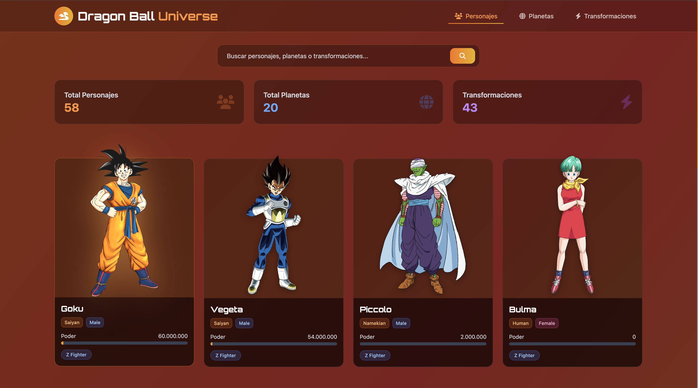
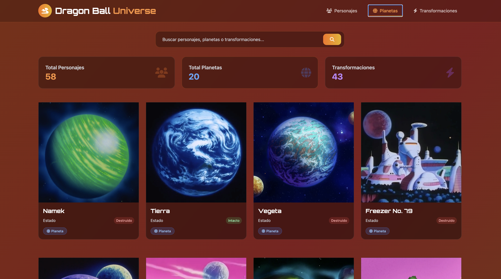
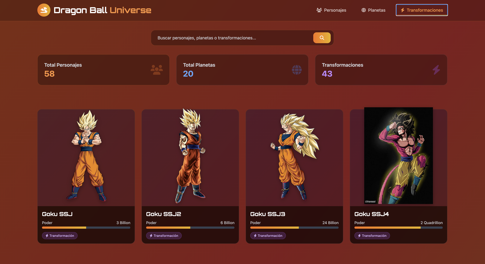
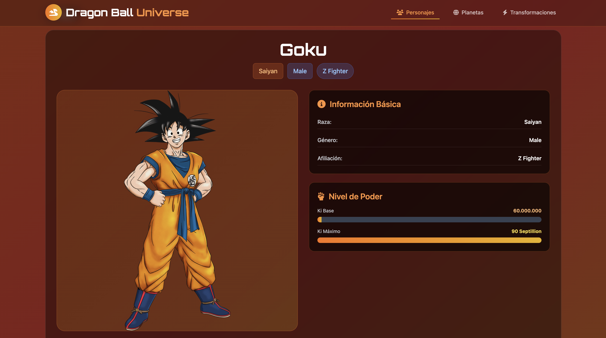
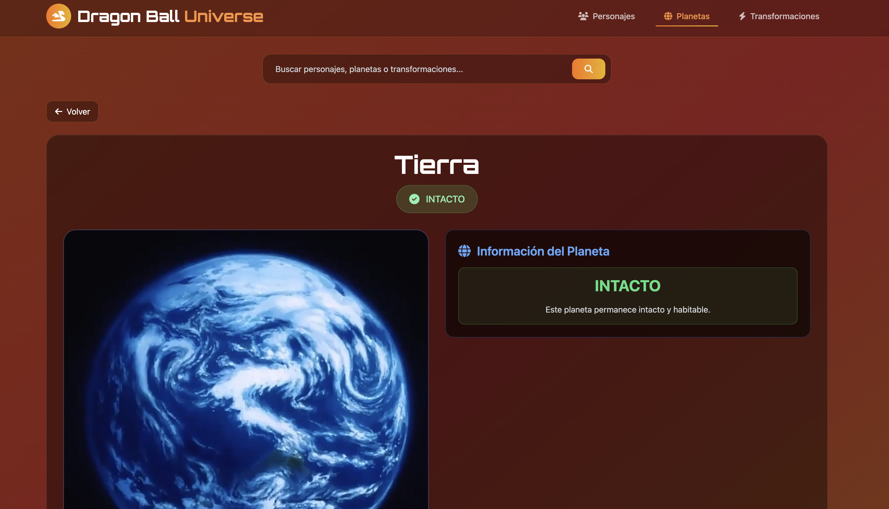
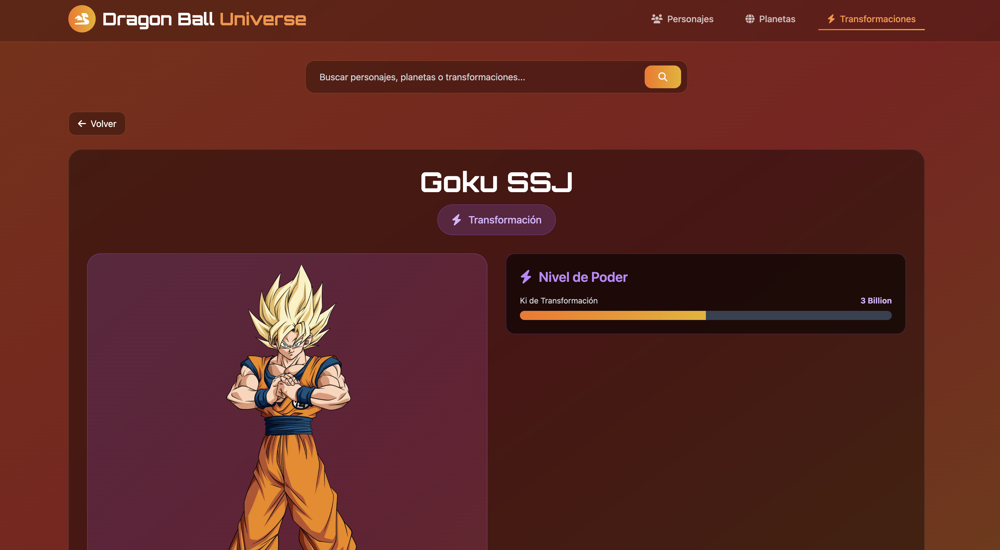

<div align="center">

# 🐉 Dragon Ball Universe Explorer

### *Una aplicación web moderna para explorar el universo de Dragon Ball*

[](https://www.typescriptlang.org/)
[](https://rxjs.dev/)
[](https://vitejs.dev/)
[](https://tailwindcss.com/)



*Explora personajes, planetas y transformaciones del universo Dragon Ball con una interfaz moderna y elegante*

</div>

---

## ✨ Características Principales

<table>
<tr>
<td width="50%">

### 🎨 **Interfaz Moderna**
- Diseño elegante con **Tailwind CSS**
- Efectos visuales avanzados y animaciones
- Tema oscuro inspirado en Dragon Ball
- **Responsive** para todos los dispositivos

### ⚡ **Arquitectura Avanzada**
- **TypeScript** con tipado fuerte
- **RxJS** para programación reactiva
- **Arquitectura modular** escalable
- **State Management** centralizado

</td>
<td width="50%">

### 🚀 **Funcionalidades Épicas**
- **Explorador de personajes** con stats de poder
- **Visor de transformaciones** animado
- **Búsqueda inteligente** en tiempo real
- **Paginación avanzada** (12 elementos por página)

### 🎯 **Experiencia de Usuario**
- **Navegación fluida** entre secciones
- **Modales detallados** para cada elemento
- **Barras de poder** visuales animadas
- **Sistema de badges** para clasificaciones

</td>
</tr>
</table>

## 🚀 Tecnologías Utilizadas

- **TypeScript** - Lenguaje principal
- **RxJS** - Programación reactiva
- **Vite** - Bundler y servidor de desarrollo
- **Tailwind CSS** - Framework de estilos
- **Font Awesome** - Iconografía
- **Google Fonts** - Tipografías (Orbitron + Inter)

## 📦 Instalación y Uso

1. **Instalar dependencias**:
   ```bash
   npm install
   ```

2. **Ejecutar en modo desarrollo**:
   ```bash
   npm run dev
   ```

3. **Construir para producción**:
   ```bash
   npm run build
   ```

4. **Vista previa de producción**:
   ```bash
   npm run preview
   ```

## 🏗️ Arquitectura Modular

<div align="center">


</div>

### 📁 Estructura de Archivos

```
src/
├── 📄 types.ts                    # Definiciones de tipos TypeScript
├── 🌐 api.ts                      # Servicio API con RxJS
├── 🎯 app.ts                      # Coordinador principal
├── 🚀 index.ts                    # Punto de entrada
├── 🎨 index.html                  # Estructura HTML
├── 💅 index.css                   # Estilos con Tailwind CSS
├── 📂 managers/
│   ├── 🗄️  StateManager.ts        # Gestión de estado centralizada
│   └── 🖼️  UIManager.ts           # Gestión de interfaz de usuario
└── 📂 modules/
    ├── 👤 CharactersModule.ts     # Lógica de personajes
    ├── 🪐 PlanetsModule.ts        # Lógica de planetas
    └── ⚡ TransformationsModule.ts # Lógica de transformaciones
```

### 🧩 Componentes Principales

<table>
<tr>
<td width="33%">

#### 🎯 **Core**
- **DragonBallApp**: Coordinador principal
- **StateManager**: Estado centralizado
- **UIManager**: Gestión de UI

</td>
<td width="33%">

#### 📦 **Módulos**
- **CharactersModule**: Personajes
- **PlanetsModule**: Planetas  
- **TransformationsModule**: Transformaciones

</td>
<td width="33%">

#### 🌐 **Servicios**
- **API Service**: Cliente HTTP reactivo
- **Error Handling**: Gestión de errores
- **Cache System**: Optimización

</td>
</tr>
</table>

## 📸 Capturas de Pantalla

<div align="center">

### 🏠 Explorador de Personajes

*Interfaz principal mostrando la galería de personajes con sistema de paginación, búsqueda y estadísticas*

### 🪐 Explorador de Planetas

*Sección de planetas con información detallada sobre cada mundo del universo Dragon Ball*

### ⚡ Explorador de Transformaciones

*Galería de transformaciones con niveles de poder y características únicas*

</div>

---

### 📋 Páginas de Detalle

<table>
<tr>
<td width="50%">

#### 👤 **Detalle de Personaje**

*Página completa con información del personaje, estadísticas de poder, raza, género y botón para ver transformaciones*

</td>
<td width="50%">

#### 🪐 **Detalle de Planeta**

*Información completa del planeta incluyendo estado (destruido/intacto) y descripción detallada*

</td>
</tr>
</table>

### ⚡ Funcionalidades Avanzadas

<table>
<tr>
<td width="50%">

#### 🔄 **Detalle de Transformación**

*Vista detallada de cada transformación con nivel de Ki y características específicas*

</td>
<td width="50%">

#### 🎬 **Visor de Transformaciones Animado**

*Modal épico que muestra la secuencia de transformaciones de un personaje con animaciones y controles*

</td>
</tr>
</table>

---

## 🎨 Diseño y UX

<table>
<tr>
<td width="50%">

### 🌙 **Tema Visual**
- **Tema oscuro** inspirado en Dragon Ball
- **Gradientes épicos** naranja/amarillo
- **Animaciones fluidas** y transiciones
- **Tipografía moderna** (Orbitron + Inter)

### 📱 **Responsive Design**
- **Mobile-first** approach
- **Breakpoints optimizados** para todos los dispositivos
- **Menú hamburguesa** en móviles
- **Grid adaptativo** (1-4 columnas)

</td>
<td width="50%">

### ♿ **Accesibilidad**
- **Navegación por teclado** completa
- **Lectores de pantalla** compatibles
- **Contraste optimizado** para legibilidad
- **Botones de 48px** mínimo (estándar móvil)

### ✨ **Efectos Visuales**
- **Hover effects** en tarjetas
- **Imágenes que sobresalen** de contenedores
- **Barras de poder** animadas
- **Loading spinners** elegantes

</td>
</tr>
</table>

## 🔧 Funcionalidades Técnicas Avanzadas

### ⚡ **Programación Reactiva con RxJS**

```typescript
// Ejemplo de stream reactivo para búsqueda
fromEvent(searchInput, 'input')
  .pipe(
    map(event => event.target.value),
    debounceTime(300),           // Optimización de requests
    distinctUntilChanged(),      // Evitar búsquedas duplicadas
    switchMap(term => searchAPI(term))
  )
  .subscribe(results => updateUI(results));
```

### 🗄️ **Gestión de Estado Centralizada**

- **StateManager** con `BehaviorSubject` para estado reactivo
- **Inmutabilidad** en todas las actualizaciones
- **Cache inteligente** para optimizar requests
- **Flags de carga** para evitar duplicados

### 🚀 **Optimizaciones de Performance**

- **Paginación eficiente**: 12 elementos por página
- **Debounce en búsquedas**: 300ms para reducir API calls
- **Cache en memoria**: Evita requests redundantes
- **Lazy loading**: Imágenes con fallbacks elegantes
- **Error boundaries**: Manejo graceful de errores

## 🌐 API Integration

La aplicación consume la Dragon Ball API para obtener:

- **Personajes**: Información completa con stats de poder
- **Planetas**: Estados y descripciones
- **Transformaciones**: Niveles de poder y características

### Endpoints Utilizados

- `GET /characters` - Lista de personajes
- `GET /characters/:id` - Detalles de personaje
- `GET /planets` - Lista de planetas  
- `GET /transformations` - Lista de transformaciones

## 🎯 Características Destacadas

<div align="center">


</div>

### ⚡ **Visor de Transformaciones Animado**

<table>
<tr>
<td width="60%">

- **Secuencia épica**: Muestra personaje original → transformaciones
- **Animaciones de poder**: Efectos de aura, flash y energía
- **Controles intuitivos**: Anterior, Siguiente, Reproducir automático
- **Parser avanzado**: Soporta Billion, Trillion, Quintillion, Septillion+
- **Visualización inmersiva**: Modal con efectos de backdrop

</td>
<td width="40%">

```typescript
// Multiplicadores soportados
const multipliers = [
  'thousand', 'million', 'billion',
  'trillion', 'quadrillion', 
  'quintillion', 'sextillion',
  'septillion', 'octillion',
  'nonillion', 'decillion'
];
```

</td>
</tr>
</table>

### 📊 **Visualización de Poder Avanzada**

- **Barras animadas** con cálculo inteligente de porcentajes
- **Parser de multiplicadores** para niveles épicos de Ki
- **Comparación visual** entre personajes y transformaciones
- **Gradientes dinámicos** según nivel de poder

### 🏷️ **Sistema de Badges Inteligente**

<table>
<tr>
<td width="25%">

#### 🧬 **Razas**
- Saiyan 🔥
- Namekian 🟢  
- Android 🤖
- Human 👤

</td>
<td width="25%">

#### ⚧️ **Géneros**
- Male ♂️
- Female ♀️
- Unknown ❓

</td>
<td width="25%">

#### ⚔️ **Afiliaciones**
- Z Fighter 🛡️
- Villain 💀
- Neutral ⚖️

</td>
<td width="25%">

#### 🪐 **Estados**
- Intact ✅
- Destroyed 💥

</td>
</tr>
</table>

### 🔍 **Búsqueda Inteligente Mejorada**

- **Debounce optimizado**: 300ms para reducir API calls
- **Filtrado multi-tipo**: Personajes, planetas, transformaciones
- **Resultados instantáneos** sin recargar página
- **Cache inteligente** para búsquedas repetidas
- **Paginación dinámica** según resultados

### 🖼️ **Efectos Visuales Épicos**

- **Imágenes que sobresalen**: Efecto 3D en hover
- **Animaciones de transformación**: Keyframes personalizados
- **Gradientes dinámicos**: Colores según tipo de elemento
- **Transiciones fluidas**: Cubic-bezier optimizadas

## 📊 Estadísticas del Proyecto

<div align="center">

<table>
<tr>
<td align="center">
<strong>🎯 Elementos</strong><br>
<code>58 Personajes</code><br>
<code>20 Planetas</code><br>
<code>25+ Transformaciones</code>
</td>
<td align="center">
<strong>⚡ Performance</strong><br>
<code>12 items/página</code><br>
<code>300ms debounce</code><br>
<code>Cache inteligente</code>
</td>
<td align="center">
<strong>🏗️ Arquitectura</strong><br>
<code>Modular</code><br>
<code>TypeScript</code><br>
<code>RxJS Reactive</code>
</td>
</tr>
</table>

</div>

## 🚀 Despliegue y Desarrollo

### 🛠️ **Scripts Disponibles**

```bash
# Desarrollo
npm run dev          # Servidor de desarrollo con HMR
npm start           # Alias para npm run dev

# Producción  
npm run build       # Construir para producción
npm run preview     # Vista previa de build de producción

# Utilidades
npm run deploy      # Despliegue automático (GitHub Pages)
npm run lint        # Verificar código con ESLint
```

### 🔧 **Configuración de Desarrollo**

<table>
<tr>
<td width="50%">

#### 📦 **Dependencias Principales**
```json
{
  "rxjs": "^7.8.1",
  "typescript": "^5.0.2",
  "vite": "^7.1.7"
}
```

</td>
<td width="50%">

#### 🎨 **Dependencias de Estilo**
```json
{
  "tailwindcss": "^3.4.1",
  "postcss": "^8.4.35",
  "autoprefixer": "^10.4.17"
}
```

</td>
</tr>
</table>

## 🤝 Contribución

<div align="center">


</div>

### 🚀 **Cómo Contribuir**

1. **Fork** el proyecto 🍴
2. **Crea** una rama para tu feature (`git checkout -b feature/EpicFeature`) 🌿
3. **Commit** tus cambios (`git commit -m 'Add epic feature'`) 💾
4. **Push** a la rama (`git push origin feature/EpicFeature`) 📤
5. **Abre** un Pull Request 🔄

### 💡 **Ideas para Contribuir**

- 🎨 Nuevos temas visuales
- ⚡ Optimizaciones de performance  
- 🌐 Internacionalización (i18n)
- 📱 Mejoras de accesibilidad
- 🧪 Tests automatizados

## 📄 Licencia

Este proyecto está bajo la **Licencia MIT** - ver el archivo [LICENSE](LICENSE) para detalles.

## 🙏 Agradecimientos Especiales

<div align="center">

<table>
<tr>
<td align="center" width="33%">
<strong>🐉 Dragon Ball API</strong><br>
<a href="https://web.dragonball-api.com/">API oficial</a><br>
<em>Datos del universo DB</em>
</td>
<td align="center" width="33%">
<strong>🎨 Akira Toriyama</strong><br>
<em>Creador del universo</em><br>
<em>Dragon Ball</em>
</td>
<td align="center" width="33%">
<strong>👥 Comunidad Dev</strong><br>
<em>Herramientas y librerías</em><br>
<em>Open Source</em>
</td>
</tr>
</table>

</div>

---

<div align="center">

### 🌟 **¡Explora el Universo Dragon Ball como nunca antes!** 🌟

**Desarrollado con ❤️, ⚡ y TypeScript**

[](https://github.com/yourusername/dragon-ball-explorer)
[](https://www.typescriptlang.org/)
[](https://rxjs.dev/)

</div>
